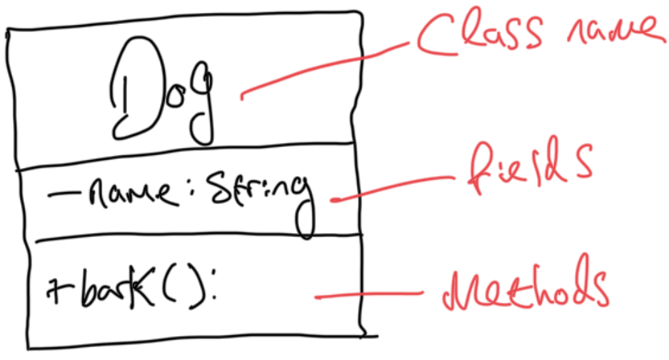
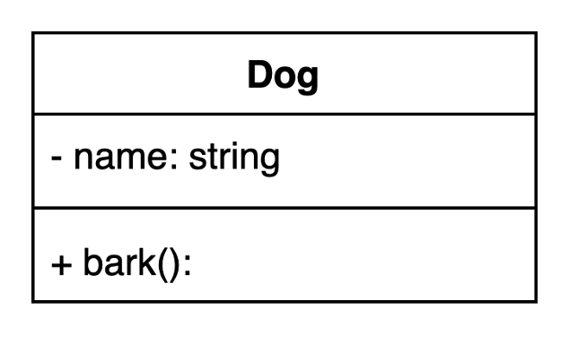
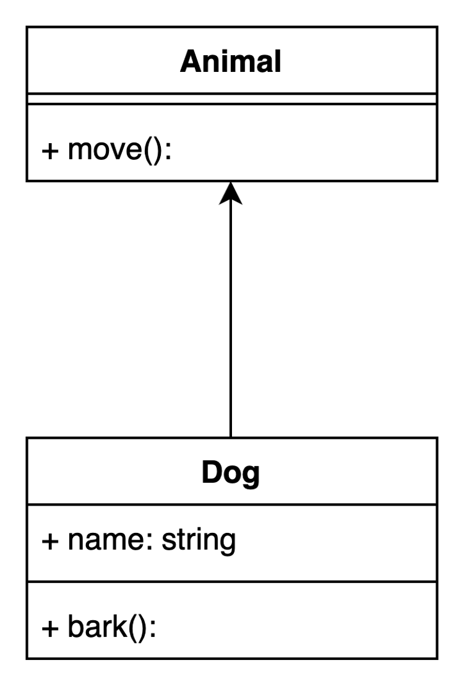
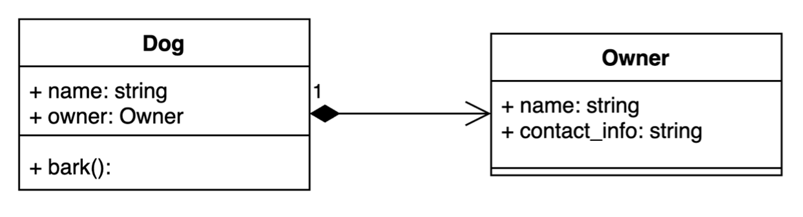
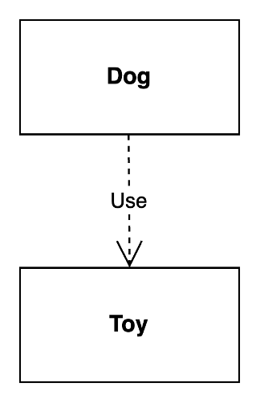

# UML

## A Class

```py
class Dog:
    def __init__(self, name: str):
        self.__name = name  # Private attribute

    def bark(self):
        """Simulate the dog barking."""
        print(f"Woof woof, my name is {self.__name} ;)")
```





## Inheritance

```py
class Animal:
    def move(self):
        print("Animal is moving")

class Dog(Animal):
    def __init__(self, name: str):
        self.name = name  # Public attribute

    def bark(self):
        """Simulate the dog barking."""
        print(f"Woof woof, mi nombre es {self.name} ;)")
```



## Composition

```py
class Owner:
    def __init__(self, name: str, contact_info: str):
        self.name = name
        self.contact_info = contact_info

class Dog:
    def __init__(self, name: str, owner: Owner):
        self.name = name
        self.owner = owner # Dog is composed of ("has a") owner

    def bark(self):
        """Simulate the dog barking."""
        print(f"Woof woof, mi nombre es {self.name} ;)")

# Example useage
dog = Dog("Bruce", Owner(name="Danny", contact_info="Call 01723 444 123 or Email danny@doabledanny.com"))
print(dog.owner.contact_info)
```



## Dependency

```py
class Toy:
    def __init__(self, name: str):
        self.name = name

    def make_noise(self) -> str:
        """Return the sound the toy makes."""
        return f"{self.name} makes a squeaky sound!"

class Dog:
    def __init__(self, name: str):
        self.name = name

    def play_with_toy(self, toy: Toy) -> None:
        """This method depends on a Toy instance."""
        print(f"{self.name} is playing with {toy.name}.")
        print(toy.make_noise())

# Example usage
toy = Toy("Squeaky Bone")
dog = Dog("Max")

# Dog interacts with the Toy object
dog.play_with_toy(toy)

# LOGS:
# Max is playing with Squeaky Bone.
# Squeaky Bone makes a squeaky sound!
```


